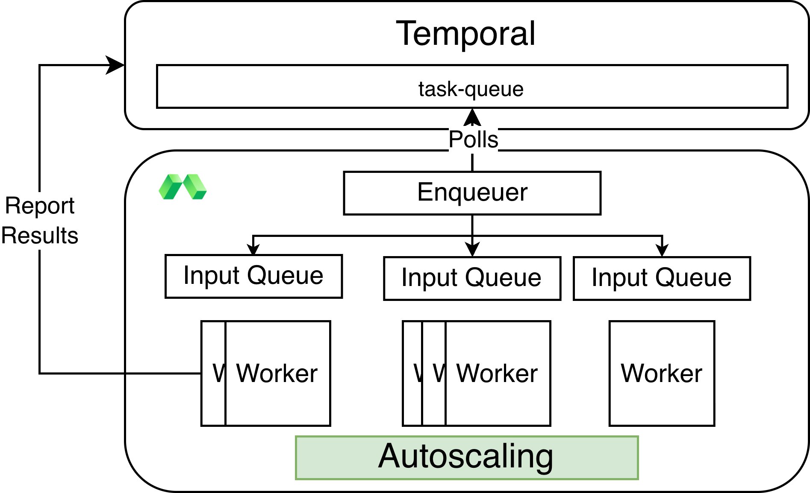

# Modal+Temporal Demo

Run your Modal functions as Temporal activities with just a decorator:

```python
@modal_activity(app, ...)
async def embed(value: str) -> list[float]:
    ...
```

You can modify [modal_temporal.py](modal_temporal.py) to fit your needs.

## Demo Instructions

0. Clone this branch

```bash
git clone -b thomasjpfan/native-worker https://github.com/modal-projects/modal-temporal
cd modal-temporal
```

1. Install [uv](https://docs.astral.sh/uv/getting-started/installation/)

2. Deploy temporal server in a Modal Sandbox, which is only used for testing. To connect to your own cluster, update `get_temporal_client` in [modal_temporal.py](modal_temporal.py) with your credentials.

```bash
uv run inv develop
```

which should output:

```
🚀 Temporal started on Modal!
🌎 Temporal UI: ...w.modal.host
💻 Configure your local environment by running:

source .modal_temporal/activate
```

You can go to the link above to see the Temporal UI.

3. Run `source .modal_temporal/activate` to configure your local environment to connect to Temporal in the Modal sandbox

4. Deploy Temporal worker in Modal and launch the queuer:

```bash
uv run modal deploy simple_flow.py
```

5. Launch workflow:

```bash
uv run simple_flow.py
```

Go to the Temporal dashboard + Modal UI to see workflows completed and Modal scale up containers.

4. Clean up sandbox and App.

```python
uv run inv stop
```

## How does it work?

The `Enqueuer` polls tasks from Temporal's task queue and puts them on Modal input queues. The Modal Function auto-scales and runs the Temporal activity. When it finishes, the results are reported back to Temporal directly.



### Implementation details

The `modal_activity` decorator defined in [modal_temporal.py](modal_temporal.py) registers Modal functions suffixed by `_runner`. These Modal functions accept the function arguments and Temporal handle to report results back to Temporal.
